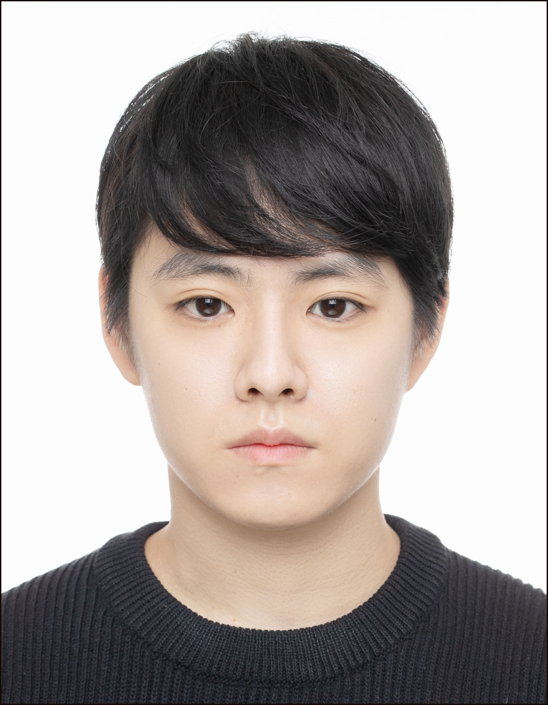

<h1 align="center">Youngjin Lee</h1>

<table align="center">
  <tbody>
    <tr>
      <td><b>Information</b></td>
<!--       <td width="20%" rowspan="10"> -->
<!--          -->
      </td>
    </tr>
    <tr>
      <td>
        <ul>
          <li><a href="mailto:lyj72011648@gmail.com" title="E-mail">lyj72011648@gmail.com</li>
          <li><a href="https://www.notion.so/Home-9e3211a55b694442acbea0113d3cec57" title="Notion">Notion</a></li>
          <li><a href="https://ethanyjlee.github.io/app_data_portfolio.pdf" title="Portfolio">Portfolio</a></li>
        </ul>
      </td>
    </tr>
  </tbody>
</table>
            

<h1>TECH STACKS</h1>

 
  
  
<!--    -->
  
  
  
   
  
   
   
<!--     -->
<!--    -->
   
  
   
   
  
   
  
   
  
  
<!--    -->
  
   
 
  
  
   
  
  
  
  
  
   

<!--
<h1 align="left">Team Projects</h1>

|| Title | Description | Skills | 
|-----| ------------ | ------------- | ------------- |
| 2023.03 | Semosin | 신발 브랜드, 모델 예측 및 거래 앱 | Flutter, Firestore, Python, Flask, MVVM Pattern |
| 2023.01 | Table Track | 제주도 외식업종 매출액 예측 및 관리 앱 | Flutter, Firestore, Python, Flask |
| 2023.01 | Dr.Oh | 당뇨병, 뇌졸중, 치매 유병률 예측 앱 | R, Flutter, Firestore, MVVM Pattern |
| 2022.11 | Hoping | 캠핑장 공유 서비스 플랫폼 | Spring Boot, MySQL |
| 2022.11 | Hoping | 캠핑장 공유 서비스 플랫폼 | JSP&Servlet, MVC Pattern, MySQL |
| 2022.10 | Noon | 카페 키오스크, 어플, 고객관리시스템 | Java, Swing, MySQL |

-->

<!-- 
<h1 align="center">Personal Works</h1>

|| Title | Description | Skills | 
|-----| ------------ | ------------- | ------------- |
| 2022.12 | Scrap Book | 프라이빗 포토 앨범 및 다이어리 작성 어플 | Flutter |

 
-->

<!--
# Github Stats

|  |  |
| ------------- | ------------- |

-->
<!--
# Project Repositories

-->

<h1 align="left">Certifications</h1>

| | Title | Level | Organization | Region |
| ----- | ----- | ----- | ----- | ----- |
| 2025.11 | AICE: AI Certificate for Everyone | Associate | KT & The Korea Economic Daily | Republic of Korea |
| 2025.08 | JLPT | N3 | The Japan Foundation / Japan Educational Exchanges and Services | Japan |
| 2025.08 | TOEIC | 890 | ETS | The United States of America
| 2025.06 | 정보처리기사(Engineer Information Processing) | | Human Resources Development Service of Korea | Republic of Korea |
| 2025.04 | SQL개발자(SQLD: Structured Query Language Developer) | | K-Data | Republic of Korea |
| 2023.03 | 데이터분석준전문가(ADsP: Advanced Data Analytics Semi-Professional) | | K-Data | Republic of Korea |
| 2022.03 | TESAT(Test of Economic Sense And Thinking) | 2 | The Korea Economic Daily | Republic of Korea |
| 2022.02 | 투자자산운용사(Certified Investment Manager) | | KOFIA | Republic of Korea |
| 2016.12 | 프로그래밍기능사(Craftsman Programming) | | HRD Korea | Republic of Korea |

<h1 align="left">Education</h1>

| | Program | Place | Location |
| -------- | ------ | ---- | ---- |
| 2025.08 - 2025.12 | INISW(Intelligence Information SW Academy) | Korea University | Seoul, Korea |
| 2022.09 - 2023.03 | Bigdata Analysis & Recommendation System Developer Program | TJ Academy | Seoul, Korea |
| 2014.03 - 2022.02 | Bachelor of Hospitality and Tourism Management | Sejong University | Seoul, Korea |
| 2013.03 - 2014.02 | Secondary School | Seoul Sejong High School | Seoul, Korea |
| 2010.12 - 2012.12 | Secondary School | The British School of Beijing | Beijing, China |

